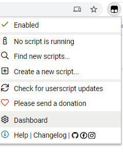
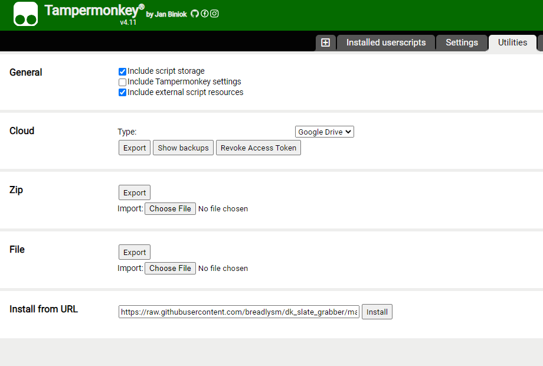

# DK Slate Grabber
This userscript was whipped together to add a download all link to the upload lineups page. https://www.draftkings.com/lineup/upload#

I created it for the NFL season and only works on Classic and Showdown lineups at the moment. I may add more. 

I use this with TamperMonkey on Chrome. 
To setup:
1. Install TamperMonkey extension. 
    [https://chrome.google.com/webstore/detail/tampermonkey/dhdgffkkebhmkfjojejmpbldmpobfkfo?hl=en]
2. Open TamperMonkey Dashboard

3. Go to utilities and input "https://raw.githubusercontent.com/breadlysm/dk_slate_grabber/master/lineup.js" into "Install from URL". Then click install. 

This will install the script. It will only work when you're on https://www.draftkings.com/lineup/upload#. By installing the script this way, any updates will also be added too. 

There are ways to turn off the updates and you can also copy and paste script. Not writing out instructions for these though as there are plenty of guides out there to do this. 

